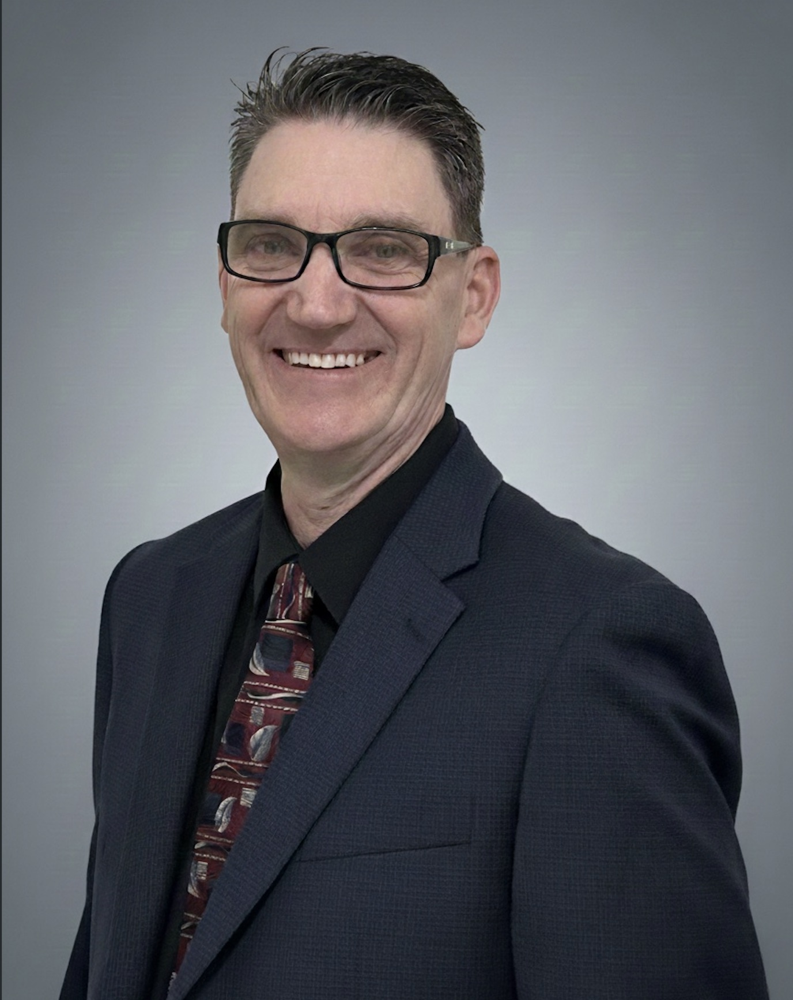

# About Me
I am a public service professional transitioning into the IT and cybersecurity field. With extensive experience in supporting people in customer-facing roles, I bring strong communication skills, problem-solving ability, and a dedication to helping others succeed. Now, I am applying those same strengths to technology.

My background in service coordination taught me to guide individuals through complex processes, explain difficult concepts clearly, and remain adaptable under pressure. These strengths align closely with IT roles that require both technical understanding and human-centered problem-solving.

I am seeking opportunities where I can contribute, learn, and grow – whether in cybersecurity, IT support, or related technology roles. I value integrity, collaboration, and continuous improvement, and I am eager to apply my skills and grow with a team that values integrity, collaboration, and continuous improvement. 

You can find my full resume [HERE](https://denverlatham.github.io/resume.html)
Or you can download the PDF [HERE](Denver_Latham_Resume_2026.pdf)

## Certifications
- [CompTIA A+](https://www.credly.com/badges/894f3f03-331f-47d1-944f-2e57b2340933/public_url) 
- [CompTIA Network+](https://www.credly.com/badges/7195c631-0c55-44a5-bbac-0d164178d144/public_url)
- [Google IT Support](https://www.credly.com/badges/51e39e10-f0d7-4200-872e-8290ff7e9a4a/public_url)
- [ISC2 CC](https://www.credly.com/badges/5dc7c014-b183-4daf-9854-59704a418df2/public_url)
  
  

## Projects
- [My Cybersecurity Journey](https://denverlatham.github.io/my-cybersecurity-journey/)

## Contact Info

[Contact Me](mailto:denverL1975@gmail.com)

[My LinkedIn](https://www.linkedin.com/in/denver2terp/)

